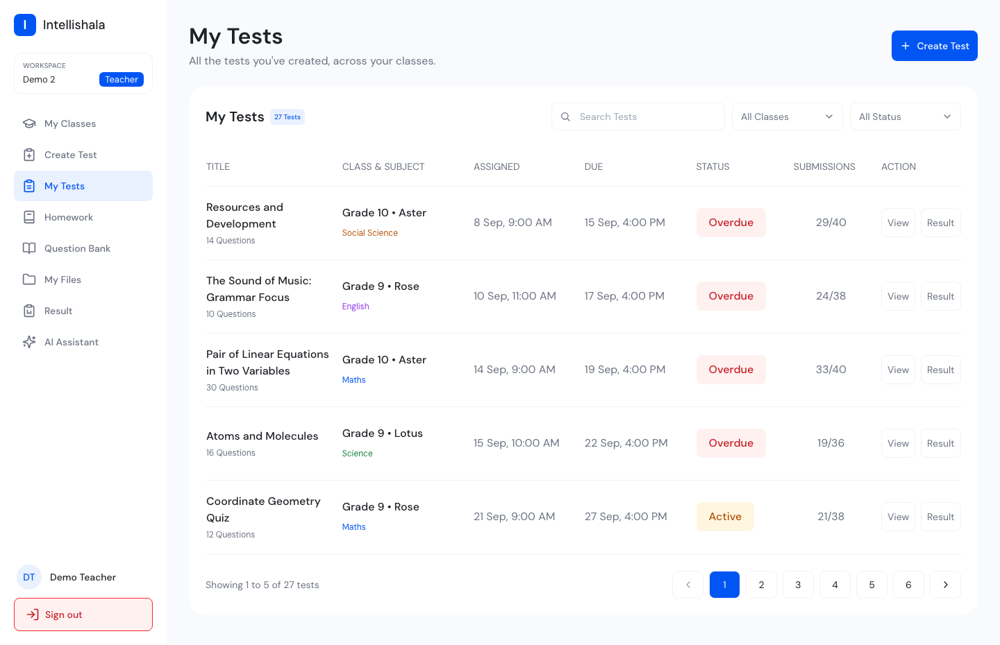
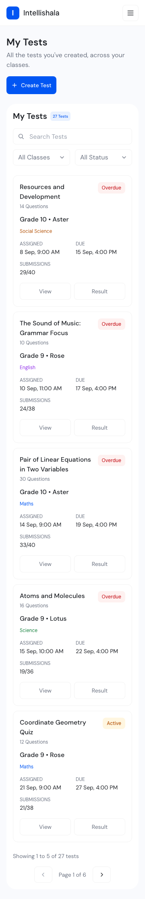

# Intellishala My Tests

Live: https://intellishala-my-tests.vercel.app
Empty state (no tests at all): https://intellishala-my-tests.vercel.app/empty

## How to run

Needs Node 20.9 or newer.

```
npm install
npm run dev
```

Then open http://localhost:3000. The "no tests" state is at http://localhost:3000/empty.

For the production version:

```
npm run build
npm run start
```

## Screenshots

1440



360


